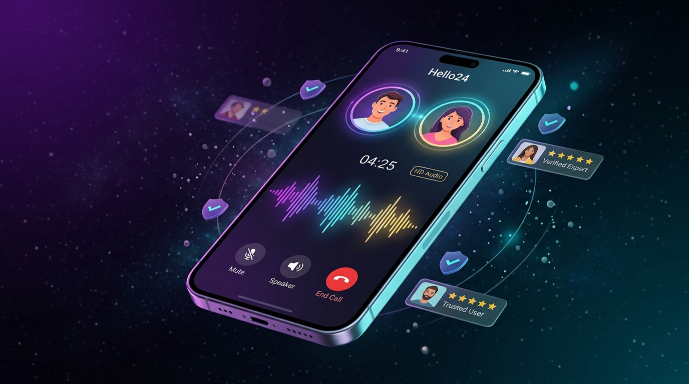
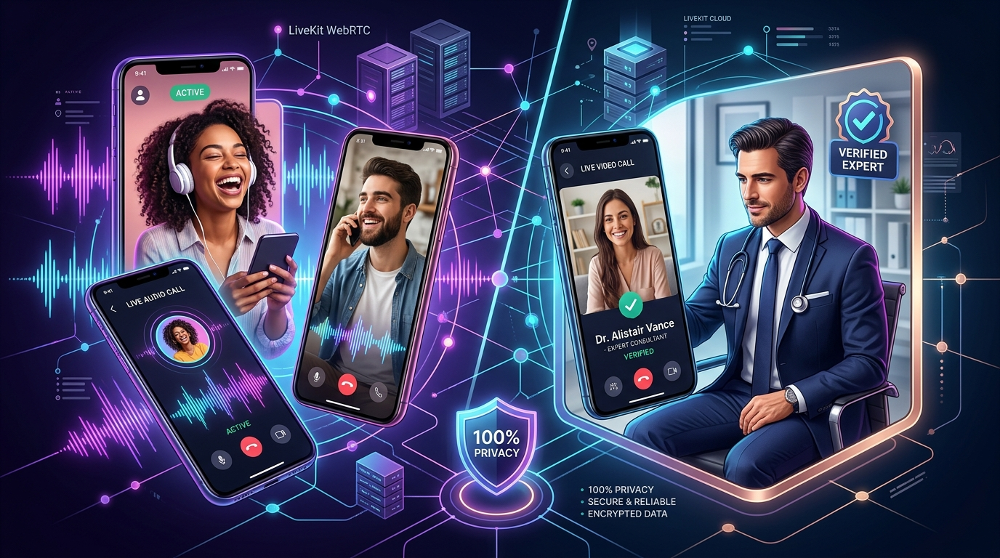
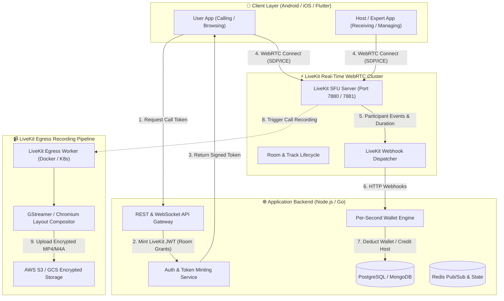

# 📞 Hello24 — Next-Gen App-to-App Voice & Video Calling Platform

<p align="center">
  
</p>

<p align="center">
  <a href="#"></a>
  <a href="#"></a>
  <a href="#"></a>
  <a href="#"></a>
  <a href="#"></a>
  <a href="#"></a>
</p>

---

## 🌟 Overview

**Hello24** is an enterprise-grade, high-concurrency **App-to-App VoIP Calling & Consultation Marketplace**. Built on **LiveKit SFU** and **LiveKit Egress**, Hello24 connects users for instant 1-on-1 voice & video conversations with zero phone number exposure and per-second transparent wallet billing.

The platform powers two major ecosystems:
1. **💑 Social & Friend Calling (Ladka/Ladki se Baat / Companionship)**: Anonymous and safe 1-on-1 audio calling with new friends, late-night talks, music discussions, language practice, and vibe matching.
2. **💼 Verified Professional & Expert Consultations (Professional se Baat)**: Direct private audio/video consultations with KYC-verified Doctors, Psychologists, Astrologers, Legal Advisors, and FAANG Tech Mentors.

<p align="center">
  
</p>

---

## 🚀 Key Highlights & Features

### 1. 👫 Social Match & Friend Calling (Ladka / Ladki Direct Connect)
- **15-Second Voice Bios**: Preview genuine voice introductions and vibes before dialing.
- **Interest & Mood Tags**: Bollywood, Late Night Vibe, Gaming, Friendship, Heart-to-Heart, English Practice.
- **100% Anonymity Shield**: No personal phone numbers, WhatsApp numbers, or private emails are ever shared between callers.
- **Fair Host Rates**: Hosts set their rates (e.g., ₹4 – ₹8/min) and earn money daily.

### 2. 👨‍⚕️ Verified Professional Consultation Marketplace
- **Verified Blue Checkmark**: Strict KYC and credential verification for doctors, astrologers, counselors, and lawyers.
- **HD Video & Audio Modes**: Crystal clear Opus 48kHz audio with optional H.264/VP8 video streaming.
- **Direct 1-on-1 Session Rooms**: Secure, dedicated room tokens minted per consultation.

### 3. ⚡ Powered by LiveKit WebRTC SFU
- **Sub-35ms Latency**: Ultra-fast peer-to-server routing across distributed edge nodes.
- **Adaptive Bitrate & Jitter Buffer**: Crystal clear sound even on spotty 2G/3G/4G cellular networks.
- **End-to-End Encryption**: Secure DTLS-SRTP encrypted audio/video channels.

### 4. 📹 LiveKit Egress Recording & Archiving Engine
- **Automated Cloud Recording**: Containerized LiveKit Egress workers record consultation audio/video sessions for compliance and user dispute resolution.
- **Room & Track Composite**: Combines participant audio streams into high-fidelity MP4/M4A/OGG formats.
- **Direct S3 / GCS Export**: Instant streaming and encrypted storage to Amazon S3, Google Cloud Storage, or Azure Blob.

### 5. 💳 Per-Second Rupee Wallet & Creator Payouts
- **Per-Second Billing**: If a call lasts 1 minute and 14 seconds, the user is billed for exactly 74 seconds.
- **Instant UPI Cashout**: Hosts and consultants withdraw earnings daily via UPI (PhonePe, Google Pay, Paytm) or IMPS.

---

## 🏗️ System Architecture



---

## 🛠️ LiveKit & LiveKit Egress Configuration

### 1. `livekit.yaml` (LiveKit SFU Server Configuration)
```yaml
port: 7880
rtc:
  tcp_port: 7881
  port_range_start: 50000
  port_range_end: 60000
  use_external_ip: true

keys:
  API_KEY_HELLO24: "secret_livekit_hello24_production_key"

webhook:
  api_key: "API_KEY_HELLO24"
  urls:
    - "https://api.hello24.app/webhooks/livekit"

redis:
  address: "localhost:6379"

audio:
  # High-Fidelity Opus Codec
  bitrate: 48000
```

### 2. `egress.yaml` (LiveKit Egress Worker Configuration)
```yaml
api_key: "API_KEY_HELLO24"
api_secret: "secret_livekit_hello24_production_key"
ws_url: "ws://localhost:7880"

redis:
  address: "localhost:6379"

s3:
  access_key: "${AWS_ACCESS_KEY_ID}"
  secret: "${AWS_SECRET_ACCESS_KEY}"
  region: "ap-south-1"
  bucket: "hello24-encrypted-call-recordings"
```

### 3. Server-Side Token Minting (Node.js Example)
```javascript
const { AccessToken } = require('livekit-server-sdk');

function generateCallToken(roomName, participantIdentity, isHost = false) {
  const at = new AccessToken(
    process.env.LIVEKIT_API_KEY,
    process.env.LIVEKIT_API_SECRET,
    {
      identity: participantIdentity,
      name: participantIdentity,
      ttl: '1h',
    }
  );

  at.addGrant({
    roomJoin: true,
    room: roomName,
    canPublish: true,
    canSubscribe: true,
    canPublishData: true,
    roomAdmin: isHost,
  });

  return at.toJwt();
}
```

### 4. Triggering LiveKit Egress Recording (Room Composite)
```javascript
const { EgressClient, EncodedFileOutput, S3Upload } = require('livekit-server-sdk');

const egressClient = new EgressClient(
  'http://localhost:7880',
  process.env.LIVEKIT_API_KEY,
  process.env.LIVEKIT_API_SECRET
);

async function startCallRecording(roomName) {
  const output = new EncodedFileOutput({
    filepath: `recordings/${roomName}-{time}.mp4`,
    output: {
      case: 's3',
      value: new S3Upload({
        accessKey: process.env.AWS_ACCESS_KEY_ID,
        secret: process.env.AWS_SECRET_ACCESS_KEY,
        region: 'ap-south-1',
        bucket: 'hello24-encrypted-call-recordings',
      }),
    },
  });

  const info = await egressClient.startRoomCompositeEgress(roomName, {
    file: output,
    audioOnly: true, // Set to false for video consultation recordings
  });

  console.log(`LiveKit Egress started: ${info.egressId}`);
  return info.egressId;
}
```

---

## 💻 Tech Stack

| Layer | Technologies |
|---|---|
| **Real-time WebRTC** | [LiveKit SFU](https://livekit.io), [LiveKit Egress](https://github.com/livekit/egress), Opus Codec (48kHz) |
| **Mobile Client** | Flutter / React Native / Android Kotlin & iOS Swift SDKs |
| **Web Frontend** | Vanilla HTML5, Modern Cyber CSS3 (Glassmorphism), Lucide Icons, Canvas Visualizer |
| **Backend & APIs** | Node.js (Express/Fastify) / Golang, Redis Pub/Sub, WebSockets |
| **Database** | PostgreSQL / MongoDB, Redis Session Store |
| **Media Archival** | AWS S3 / GCS Encrypted Object Storage |
| **Payments** | UPI Gateway, Razorpay, Cashfree, BHIM / Paytm / PhonePe |

---

## ⚡ Quick Start & Setup

### 1. Clone the Repository
```bash
git clone https://github.com/premranjanpro/hello_website.git
cd hello_website
```

### 2. Start LiveKit Server & Redis with Docker Compose
```bash
docker run -d --name livekit-server \
  -p 7880:7880 \
  -p 7881:7881 \
  -p 50000-50020:50000-50020/udp \
  livekit/livekit-server \
  --dev
```

### 3. Start LiveKit Egress Worker (Optional for Recording)
```bash
docker run -d --name livekit-egress \
  --net=host \
  -v $(pwd)/egress.yaml:/config.yaml \
  livekit/egress:latest \
  --config /config.yaml
```

### 4. Run the Static Web Portal & Interactive Simulator
You can serve the static portal using any local server:
```bash
# Using Python
python -m http.server 8080

# Or using Node.js npx serve
npx serve .
```
Visit `http://localhost:8080` in your browser to test the interactive live calling simulator!

---

## 📡 API & Webhook Specifications

### 1. `POST /api/v1/calls/initiate`
Initiates a 1-on-1 call between a user and a companion/professional host.
```json
{
  "caller_id": "usr_948210",
  "host_id": "hst_dr_alistair_vance",
  "call_type": "AUDIO_1ON1",
  "max_duration_seconds": 1800
}
```
**Response:**
```json
{
  "status": "SUCCESS",
  "room_name": "room_call_849204_9921",
  "livekit_url": "wss://livekit.hello24.app",
  "token": "eyJhbGciOiJIUzI1NiIsInR5cCI6IkpXVCJ9...",
  "rate_per_second": 0.4166
}
```

### 2. `POST /webhooks/livekit` (Server Webhook Handler)
Handles participant connect/disconnect events to manage per-second wallet deduction:
```json
{
  "event": "participant_left",
  "room": {
    "name": "room_call_849204_9921"
  },
  "participant": {
    "identity": "usr_948210",
    "joined_at": 1724050200,
    "duration": 342
  }
}
```

---

## 🔒 Security, Trust & Safety

- **Zero Phone Number Leakage**: Both parties interact exclusively through ephemeral WebRTC rooms.
- **Automated AI Safety & Moderation**: Live speech analysis flag inappropriate or abusive behavior in public stages.
- **1-Tap Instant Block & Report**: Immediate disconnect and blacklist functionality.
- **Strict KYC Verification**: Government ID & Degree validation for medical and legal practitioners.

---

## 📄 License

This project is licensed under the **MIT License** — feel free to use and extend it for your own real-time voice and video applications.

<p align="center">
  Made with ❤️ by the <b>Hello24 Core Engineering Team</b> • Powered by <b>LiveKit & WebRTC</b>
</p>
